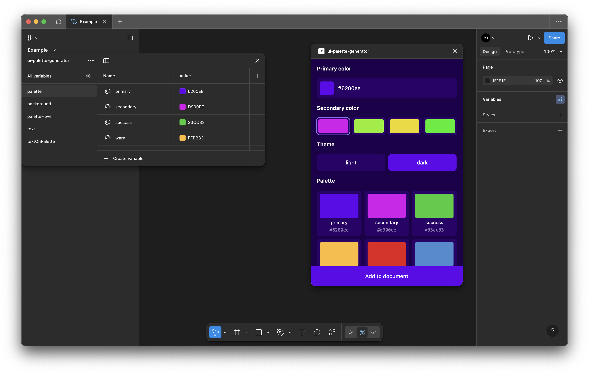

# UI Palette Generator

UI Palette Generator is a Figma plugin that instantly creates accessible light and dark UI color palettes based on a single primary color. Perfect for designers building scalable, consistent design systems, it automatically generates all necessary palette shades, hover states, backgrounds, and text colors — ensuring optimal contrast and readability.

## Key Features

**Primary-to-Palette Generation** \
Create a full set of primary, secondary, success, warning, error, and info colors from one primary color.

**Background Shades (z0–z5)** \
Smoothly blended background colors for depth and elevation in both light and dark themes.

**Hover Variants** \
Automatically generates hover states for all palette colors.

**Text Scales** \
Includes base, light, lighter, and lightest text opacities.

**Text on Palette** \
Provides accessible text-on-color pairs (e.g., textBaseOnPrimary).

**Variable Mode Support** \
Adds light and dark palettes as variable modes with one click (free plan adds only the selected theme).

**Live Preview** \
Instantly see how generated colors look in real UI components.

Ideal for UI designers and teams who need fast, accessible, and systematic color palettes that are ready to use in Figma.